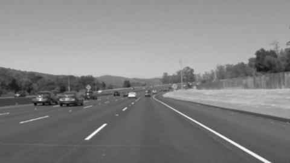
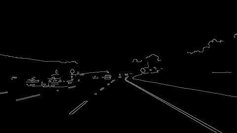
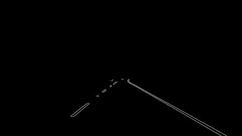
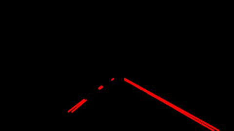
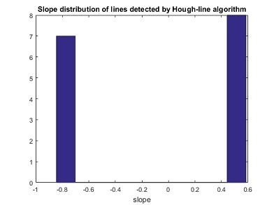
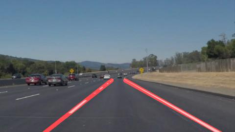
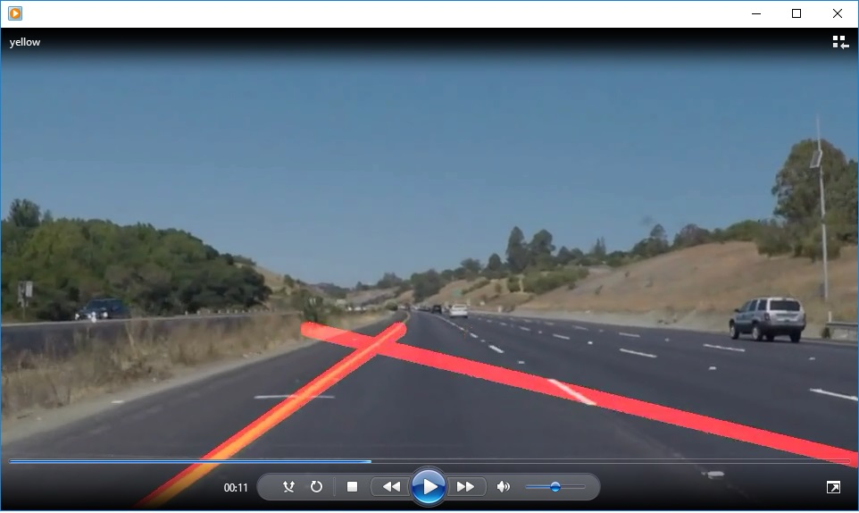
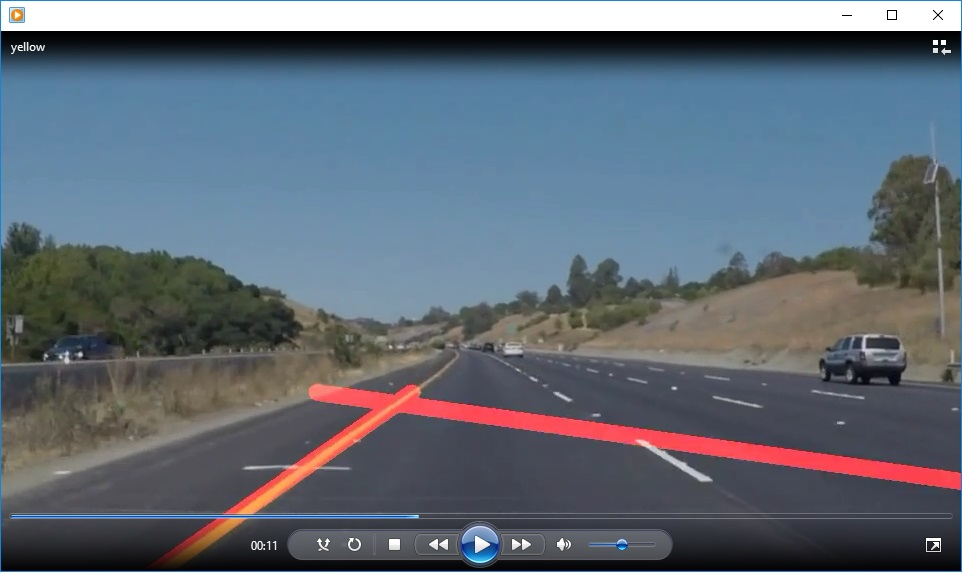
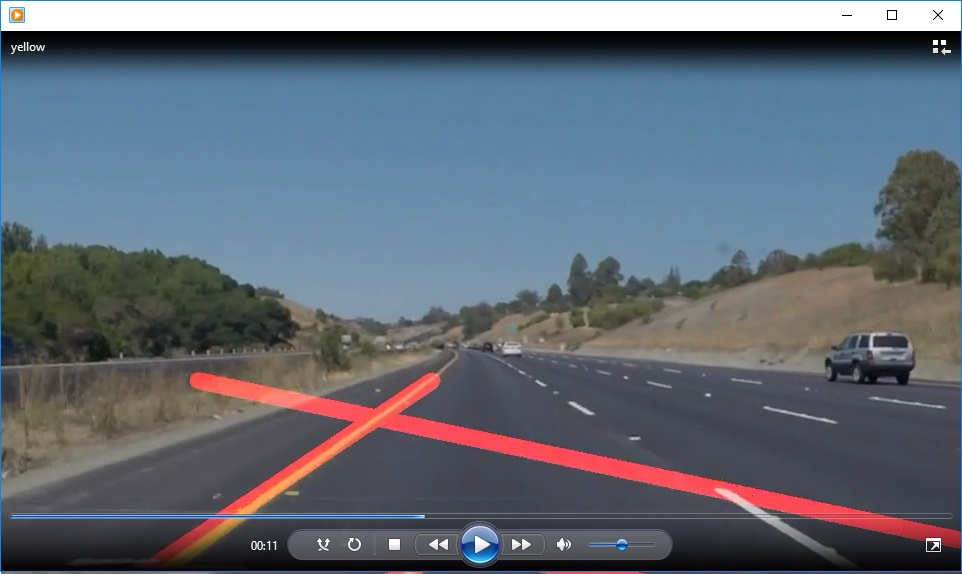
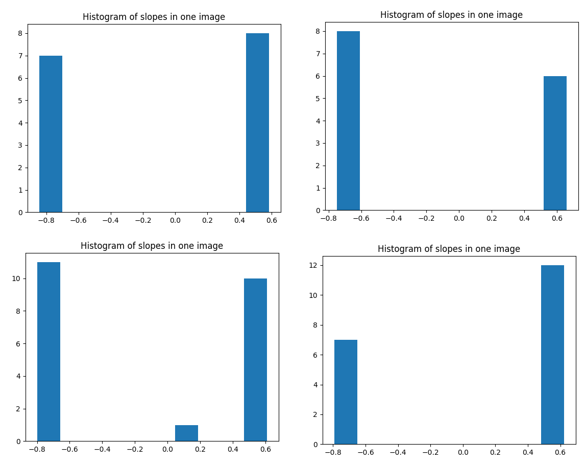

# Project 1 Writeup #
 *by Rebecca Shuang Gao* 
 
The project requires the following objectives:

1. Find slope segments for each image
2. Average/extrapolate slope segments to full two lines for a single image
3. Make improvements and adjust the codes to videos, ensuring lines are continuous and consistent in the frames
##Thinking##
The project provides some test images for me to play on the parameters. The images are frames belongs to the videos. 
For a specific self-driving car, since the camera used to detect the front view should be fixed to the vehicle, the following components that determines the lane detection are mostly constant:

* the camera’s relative height to the ground and the car
* the angle of the camera’s face from the surface

Therefore it’s reasonable to use some parameters (e.g., region of interest, the angle of the two lines of lanes from the horizon) calibrated from the test images.
The following components that also influence the detection may vary as one car travels:

* The width of a lane might change, so the angles of the two lane lines from the horizon may change.
* The color, width, and visibility of each lane line might change
* The extended two lines of a lane make a triangle. The vertex of the triangle might change, since the car could ride away from the middle of the lane. 

I will explain my workflow with 'solidWhiteCurve.jpg' as an example. The imagess shown in the report are shrinked to be of half size for compaction.

##Find slope segments for each image##

This process is broken into several steps: 

- Preprocessing

The image is converted into a gray one, and smoothed by a Gaussian shape filter prior to the internal smoothing in Canny algorithm, since edge detection is susceptible to noise. 
Below is the image filtered by a Gaussian of radius=5.



- Edge detection by Canny

Then a Canny edge detector is applied to the smoothed image, with lower threshold=100, and higher threshold=200 for local gradients.


- Mask edges into Region of Interest

There are many irrelevant edges, as well as those to be used to merge into lane lines. 
To consider only the edges on the lane, a region of interest (ROI) is defined. 
As discussed at the beginning, ROI will remain similar through the images. For the lane detection problem, the ROI is defined as a trapezoid.
Only the edges within the ROI are kept. 



- Find lane line segments by Hough
Hough transformation is applied to the detected edges to find those edge segments on the lane. 
Rho, the length resolution, is taken to be small. A very long rho makes the resulted lines short and discret. 
Threshold is the minimum votes accepted for a line. A good threshold removes most unrelated segments. If the image is too noisy and the lane lines are not clear, the threshold should be smaller than current value, to allow the right line segments to be included.
Minimum allowed length parameter and max allowed gap parameter both have direct impacts on how discrete the segments are. 
Hough line function returns the end points of every accepted line segment. Then draw_lines function draws the segments on an a black image.



## 2. Segments to Lines ##
As is seen, hough-line result has duplicated line segments for each of the two lane lines, and the segments are discrete. What we need are two continuous lines each connecting two ends of the lane boundaries, as long as possible. On some images, even with ROI and hough-line functions, there are still line segments not belonging to the lane.
To understand the distribution of detected slope segments, I plot the histograms of detected slopes for every test image.
It is noticed that, the slopes of the lines are in the value ranges of (-1,-0) and (0,1)



To get the slope of left and right lane lines, the end points of segments returned from hough-line within the said ranges are put to left-slope-point set and right-slope-point set, respectively.

``` 
   	
	leftSlopePoints=[]
    rightSlopePoints=[]
    for line in lines:
        for x1, y1, x2, y2 in line:
            slope = (y2-y1)/(x2-x1)           
            if (slope>-1 and slope<0):                
                leftSlopePoints.append([x1,y1])
                leftSlopePoints.append([x2,y2])
            elif (slope<1 and slope>0):                
                rightSlopePoints.append([x1,y1])
                rightSlopePoints.append([x2,y2])
```			

With the x and y of each set, a Least squares polynomial (linear) fitting is performed to get the slope and intersection of each desired lane line.
For example, for the right lane line,

 *pright[0] * x + pright[1] = y*

```

    rightSlopePointArray = np.asarray(rightSlopePoints)
    x = rightSlopePointArray[:,0]
    y = rightSlopePointArray[:,1]
    pright = np.polyfit(x,y,1)
    
    xright_min = min(x)
    yright_min = xright_min*pright[0]+pright[1]   
```

So far, the results are two straight lines starting from the bottom of the image and covering on the lane boundary, but sometimes the left or right line is longer on the top.
Therefore a simple comparison to find the one with lower top is implemented, and the other line will end at the same y value at the top.

Finally, the two lines are drawn over the original image, with "weighted_img". The lines are thickened to make the marked lines visible.




##Dealing with messy lines in video#
When put the pipeline to a video clip, most image frames work fine, but there are messy lines in some video.



In a closer look, I think it is due to the irrelevant segments being involved in the slope calculation, e.g. the short white line crossing on the left lane.

Having studied the slope ranges of the sample images, I find the slopes of the lines, long or short, are in the value ranges of (-1,-0.6) and (0.4,1). After modifying the code to the stricter ranges, the messy lines disappear.
``` 
   	
	leftSlopePoints=[]
    rightSlopePoints=[]
    for line in lines:
        for x1, y1, x2, y2 in line:
            slope = (y2-y1)/(x2-x1)           
            if (slope>-1 and slope<-0.6):                
                leftSlopePoints.append([x1,y1])
                leftSlopePoints.append([x2,y2])
            elif (slope<1 and slope>0.4):                
                rightSlopePoints.append([x1,y1])
                rightSlopePoints.append([x2,y2])
```			

##Potential drawback of my project##
There are many hard-code parameters in the pipeline for the lane recognition.

1. The hard-code parameters of region of interest and the line slopes could change if the lane is not flat, like in the moutainous area, or climbing up a bridge.
Some part of the lane might be intercepted by the front view, and if in a very crowded traffic, by some vehicles ahead. For example, if the car is climbing up a steep bridge, when it is near the top of the bridge, the camera view has a large part of it with the blue beautiful sky, instead of the lane. If the car rides down the steep bridge, the front view is occupied by the path in front of the bridge, and the lane view on the bridge is suppressed. Also the lane line slopes will also be higher.

2. The lane itself could be blocked by objects, again if the car is running in a traffic jam. If the lane lines are blocked temporally, the car can still run a little while with the projected lines from previous video frames.
But if it is jammed for a long time, the method in this project becomes useless. 

##Chances of improvement##

1. My code can't run for the challenge video, since in some frames, the lines disappear. I should remember the detected lines from previous image frame, and give the lines when current frame can't find the lines.

2. To quicken the real-time processing and increase accuracy, the lines of every new frame can be predicted from a previous one, and only the lines offsets are computed. 

3. The surrounding environments should also be considered to guide the vehicle. For example, the neighbouring lanes, the passing by vehicles, the buildings can all be references. From the size and the deformation of the other objects, hints can be apparent of the condition of the terrain.

4. A sudden passing by of an objects (an animal, a person) should be alert to the vehicle monitoring system.